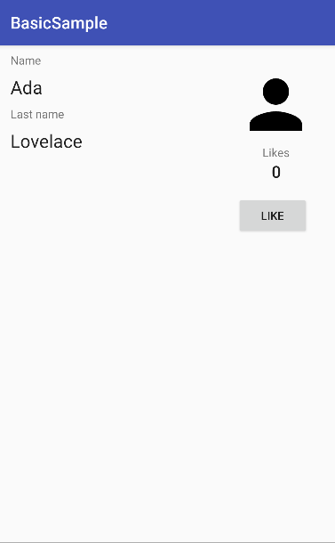
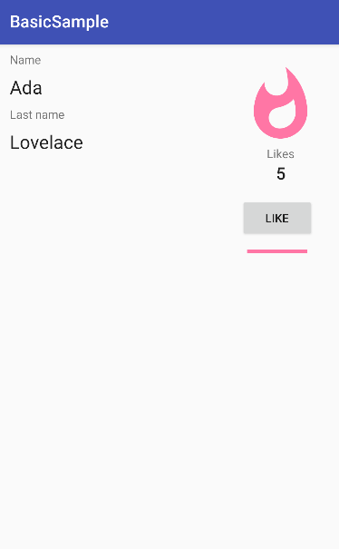
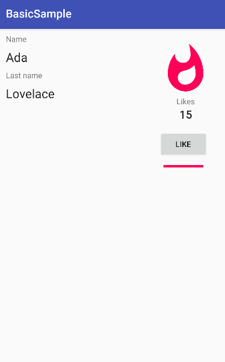

<h1 align="center">DataBinding</a> 
<h3 align="center"> This app designed with Data Binding that allows you to bind UI components in your XML layouts to data sources in your app using a declarative format.</h3>
<h1 align="center"></a>
<h4 align="center"> Screenshots of the Application below ⬇️ </h4>
<h4 align="center">    </h4>
